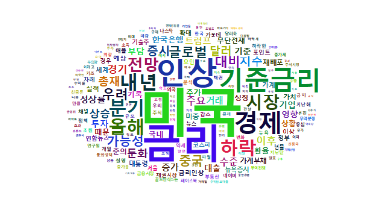

***preface*** (last update: 2018.11.26) 이번 포스트에서는 R을 이용한 웹크롤링(스크래핑)으로 모은 네이버 뉴스 검색 결과를 분석하여 워드 클라우드로 만드는 방법에 대하여 설명합니다.

# How to make a Word Cloud in in R

다음 자료를 참고하였습니다:  
- [최대한 친절하게 쓴 R로 낱말구름, 의미연결망 그리기](https://kuduz.tistory.com/1090)
- [R을 이용한 한글 텍스트마이닝 & 워드클라우드](https://kutar37.tistory.com/entry/R%EC%9D%84-%EC%9D%B4%EC%9A%A9%ED%95%9C-%ED%85%8D%EC%8A%A4%ED%8A%B8%EB%A7%88%EC%9D%B4%EB%8B%9D-%EC%9B%8C%EB%93%9C%ED%81%B4%EB%9D%BC%EC%9A%B0%EB%93%9C)

[지난번 포스트](https://dr-hkim.github.io/Naver-News-Web-Scraping-using-Keywords-in-R/)에서는 R을 이용하여 네이버 뉴스에서 원하는 키워드의 검색 결과를 웹크롤링(스크래핑) 하는 방법에 대하여 알아보았습니다. 이번 포스트에서는 지난번에 수집한 텍스트 자료를 분석하는 방법에 대하여 살펴보겠습니다.


## 패키지 설치

뉴스 기사를 분석하기 위해서는 자연어 처리라는 비정형 데이터 분석 방법을 사용해야 합니다. 우리말을 단어 단위로 나누기 위해서는 형태소 분석을 해야 합니다. 복잡한 부분은 우선 넘어가고, 이것을 실행하기 위해서는 다양한 패키지 설치와 사전 준비단계가 필요합니다.

먼저 [https://www.java.com/en/download/manual.jsp](https://www.java.com/en/download/manual.jsp) 에 접속하여 자신의 운영체제에 맞는 오프라인 버전을 설치합니다. 이번 포스트에서는 한국어의 형태소 분석을 위해 `KoNLP` 라는 패키지를 사용할 것입니다. 이 패키지를 사용하기 위해서는 `rJava` 패키지가 필요하며, `rJava` 패키지 사용을 위해서는 Java 를 깔 필요가 있습니다.

Java 오프라인을 설치했다면 아래와 같이 관련 패키지를 설치합니다. 라이브러리로 패키지를 정상적으로 불러올 수 있는지도 확인합니다. 그리고 `useNIADic()` 함수를 이용하여 `KoNLP` 패키지에 있는 형태소사전(NIADic)을 사용하겠다고 선언하면, 관련된 사전을 설치합니다.

```{r, eval=FALSE}
install.packages('Rcpp')
install.packages('tidyverse') 
install.packages('rJava')
install.packages('KoNLP')
install.packages('reshape2')
install.packages('wordcloud2')

library('tidyverse')
library('reshape2')
library('wordcloud2')
library('rJava') 
library('KoNLP')

useNIADic() # KoNLP 패키지에 있는 형태소사전(NIADic) 사용 선언
```

## 단어 분석하기

본격적인 분석을 하기 위하여 지난번에 저장한 Rdata 파일을 불러옵니다.

```{r, eval=FALSE}
load("./DATA0/NEWS.RData")
```

분석에 사용할 사전에 사용자 정의 단어를 명사로 추가합니다. "연방준비은행", "연방준비제도" 처럼 연방/준비/은행 으로 나누어 지기 쉬운 단어나 "이주열" 과 같은 주요 인물의 이름 등을 넣어주는 것이 좋습니다. 이 작업은 분석 결과와 실제 기사 내용을 여러번 비교해가면서 누락되거나 오해하기 쉬운 단어를 계속 추가해나가는 지루한 작업입니다. 텍스트 마이닝이 생각보다 노동집약적 연구라는 이유가 여기에 있습니다.

```{r, eval=FALSE}
## 사전에 사용자 단어를 명사(ncn)로 추가
mergeUserDic(data.frame(c("연방준비은행","연방준비제도","이주열"), 
"ncn")) 
```

그럼 실제로 뉴스 기사에 대한 분석을 실시하겠습니다. 각 어절의 품사를 구분하고, 원형을 찾고, 이것을 분석할 수 있는 형태로 저장하는 작업이기 때문에 분량에 따라 시간이 꽤 걸립니다. 가능하면 이 결과를 따로 저장해 두는 것을 추천합니다.

```{r, eval=FALSE}
## 뉴스 기사의 본문을 따로 추출
TEXTFILE <- NEWS$news_content

## 텍스트 파일을 읽고, 품사를 구분하고, tidytext 패키지에서 사용 가능한 tibble 형태로 저장
tbl_TEXTFILE <- TEXTFILE %>% 
  SimplePos09 %>% # 품사구분함수. SimplePos09()는 9개 품사로, SimplePos22()는 22개 품사로 구분 
  melt %>%        # 전체 자료를 tibble 형태로 저장 
  as_tibble %>%   # 전체 자료를 tibble 형태로 저장 
  select(3, 1)    # 실제 분석에 필요한 3열과 1열만 따로 저장 
```

분석 결과 가운데 명사형 자료만 골라내어 갯수를 헤아리겟습니다. '것', '수' 와 같이 별 의미가 없는 의존명사를 제외하기 위하여 한글자 단어는 빼겠습니다.

```{r, eval=FALSE}
## 명사형 자료만 골라내어 카운트
tbl_TEXTFILECOUNT0 <- tbl_TEXTFILE %>% # tbl_TEXTFILE 데이터 사용 
  mutate(noun=str_match(value, '([가-힣]+)/N')[,2]) %>% # 명사형(/N) 자료만 골라낸 후 /N 빼고 저장 
  na.omit %>% # 비어있는 값(NA) 제외 
  filter(str_length(noun)>=2) %>%  # '것', '수' 와 같이 별 의미가 없는 의존명사를 제외하기 위하여 한글자 단어는 제외
  count(noun, sort=TRUE)
```

분석 결과는 다음과 같습니다.

```{r, eval=FALSE}
head(tbl_TEXTFILECOUNT0, 10)
```

```
# A tibble: 10 x 2
   noun         n
   <chr>    <int>
 1 미국       453
 2 금리       346
 3 인상       265
 4 기준금리   221
 5 경제       209
 6 내년       168
 7 분기       158
 8 올해       158
 9 하락       155
10 시장       148
```

전체 결과를 보면 "기자", "억원", "이날" 등 뉴스 기사를 작성하면 어쩔 수 없이 들어가는 단어들이 상당수 상위에 랭크되어 있는 것을 확인할 수 있습니다. 역시 이러한 단어들은 결과를 일일이 확인해가며 필요없다고 판단되면 제외해야 합니다. 역시 노동집약적 과정입니다. `filter(n>=5)` 라는 옵션을 추가하여 최소한 5회 이상 언급된 단어만 추려냈습니다.

```{r, eval=FALSE}
## 빈도 수, 제외단어 등 필터링
tbl_TEXTFILECOUNT1 <- tbl_TEXTFILECOUNT0 %>% filter(n>=5) %>% filter(!noun %in% c(
  "기자","억원","이날"
))
```

## 워드 클라우드 만들기

이제 상위 200개 단어를 이용하여 워드클라우드를 만들어 보겠습니다. 기본적으로 나오는 폰트는 마음에 들지 않으니 맑은 고딕으로 변경하였습니다. size 설정에 따라 단어가 나타나지 않는 경우가 있습니다. 이 때에는 size 설정을 조금 줄여주면 모든 단어가 표시됩니다. 저는 워드 클라우드 안에서 단어가 회전되어 있는 것을 선호하지 않으므로 `minRotation=0, maxRotation=0` 옵션을 추가하였습니다.

```{r, eval=FALSE}
## 200대 키워드만 선정
tbl_TEXTFILECOUNT2 <- tbl_TEXTFILECOUNT1[1:200,] 

# 워드클라우드 그리기
wordcloud2(tbl_TEXTFILECOUNT2,fontFamily="Malgun Gothic", size = 0.5, minRotation=0, maxRotation=0)
```


워드 클라우드가 완성되었습니다!


